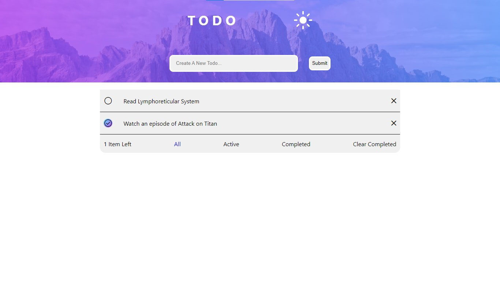
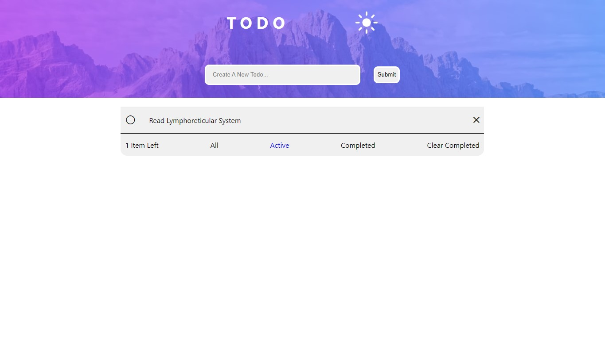
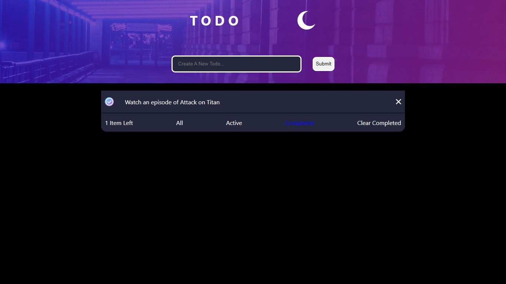

# Todo List with React

This is a todo list built with React. You can create to-do items, check and uncheck whether or not it is completed and delete them when completed. You can even filter them based on completion. Wanna see the completed tasks, sure. Click the "Completed" filter. You can even change to Dark mode and back as you deem fit. The site stores your todos in localStorage, that way there is longevity and you find your tasks even after a long time of checking the website.

## Screenshot

View all todos

View all active todos

View all completed todos in Dark mode

## Links
- Live Link: (https://opeyimika-todolist-react.netlify.app/)
- Github Repo: (https://github.com/Opeyimika-sudo/todolist-react/)

## Built With
- React
- localStorage
- Vanilla CSS

## What I Learnt
- Consolidated my knowledge of key React concepts(useState, props)
- Practiced how to work with localStorage using React
- Learnt how to tweak useState to change what's displayed in a complex fashion for the filters

## Author
- Opeyimika Aremu